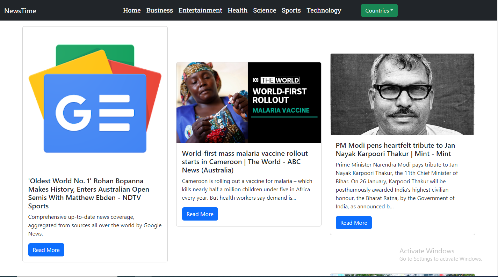
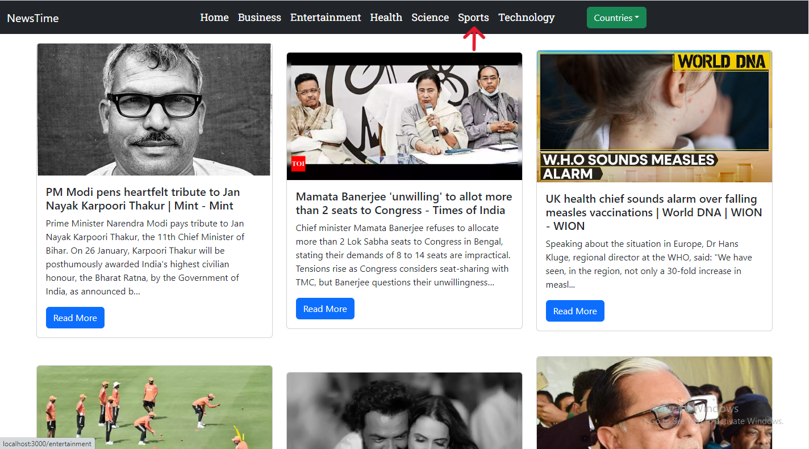
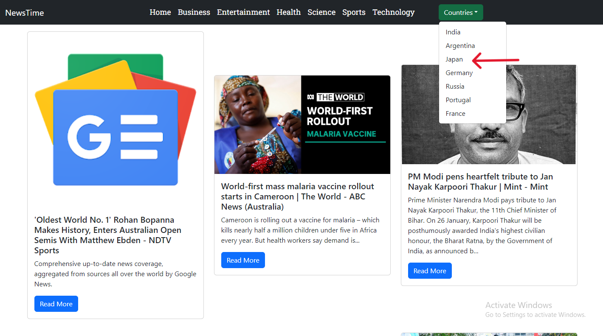
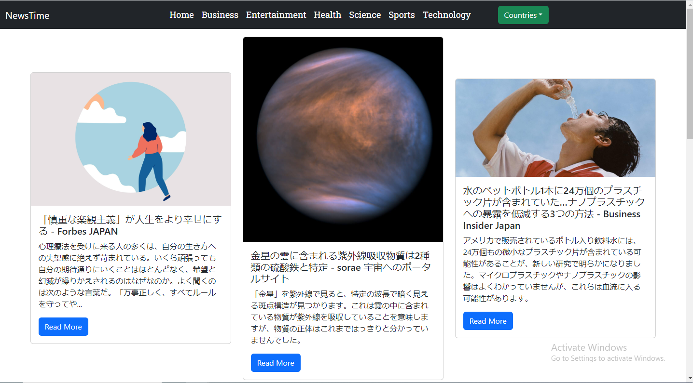

# NewsTime - React News App

NewsTime is a React-based web application that provides real-time news updates from various categories and countries. Stay informed with the latest headlines in business, entertainment, health, science, sports, technology, and more.

## Technologies Used

- **React:** Frontend library for building user interfaces.
- **Bootstrap:** CSS framework for responsive and mobile-first web development.
- **Axios:** HTTP client for making API requests.

## Features

 ### Real-Time News:
- **Get up-to-date news articles from around the world**.
 
 
 ### Category-wise Filtering:
- **Explore news based on specific categories.**
 

 ### Country Selection:
 **Customize your news feed by selecting your preferred country.**
 
 
 
 ### Changed Country to Japan:
 
 

## Usage
- Select a **category** from the navigation bar.
- Choose a country from the dropdown to customize news based on your location.
- Navigate through pages to explore more news articles.

## Installation

1. Clone the repository:
   ```bash
   git clone https://github.com/Ajayvadadre/News_app.git
   cd News_app
